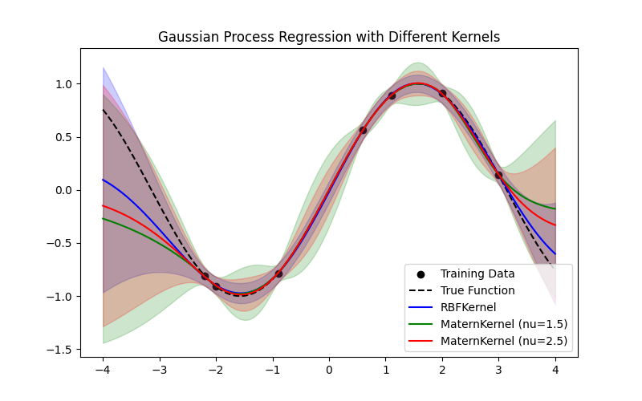
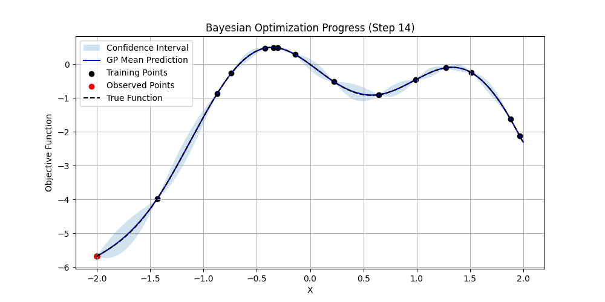
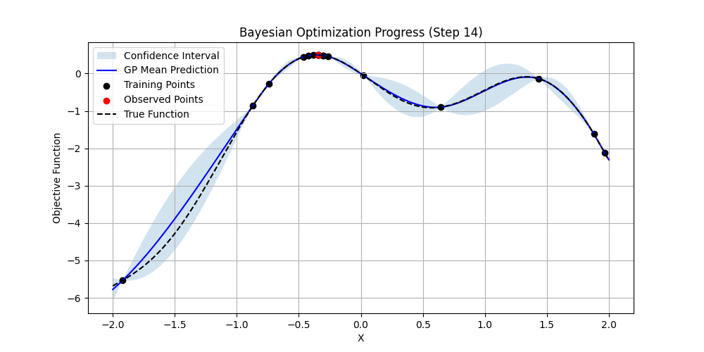

# Bayesian Optimization with Jax (BAOX)

- **baox** is a Python package for Gaussian process (GP) and single- or multi-objective Bayesian optimization. 
- It is built with Jax, a numerical computing library that allows for automatic differentiation and GPU acceleration.
- The package is designed to be modular and flexible, allowing users to easily define their own acquisition functions, kernels, and optimization algorithms.


## Examples

### Gaussian process regression

Give a set of input-output pairs `(X, y)`, we can fit a Gaussian process model to the data and make predictions at new input  `X_test`.

```python
from baox.surrogate.kernel import RBFKernel, MaternKernel
from baox.surrogate.gp import GaussianProcess

kernel = RBFKernel(lengthscale=1.0, variance=1.0)
gp = GaussianProcess(kernel, noise=1e-3)
gp.fit(X, y)
y_pred, y_std = gp.predict(X_test)
```

An example figure of GP regression is shown below.



### Single-objective Bayesian optimization using expected improvement

To optimize a single-objective function `f`, we can use the analytical expected improvement acquisition function.

```python
from baox.bo.bayesian import BayesianOptimization
import jax.numpy as jnp

# Example f
def objective_function(x):
    return -jnp.sin(3 * x) - x**2 + 0.7 * x

key = jax.random.key(0)
bo = BayesianOptimization(objective_function, bounds=(-2, 2))
X_samples, y_samples = bo.run(key, n_iter=15, use_mc=False, n_samples=10)

print(f"Best point found: {X_samples[jnp.argmax(y_samples)]}")
```





We can also use sampling-based expected improvement to optimize the objective function by setting `use_mc=True`.

```python
X_samples, y_samples = bo.run(key, n_iter=15, use_mc=True, n_samples=10)
```



## Installation

To install the package, you can use pip:

```bash
git clone https://github.com/fengyiqi/baox.git
cd baox
pip install -e .
```

The package requires `jax` >= 0.5.0 and `jaxlib` >= 0.5.0.
