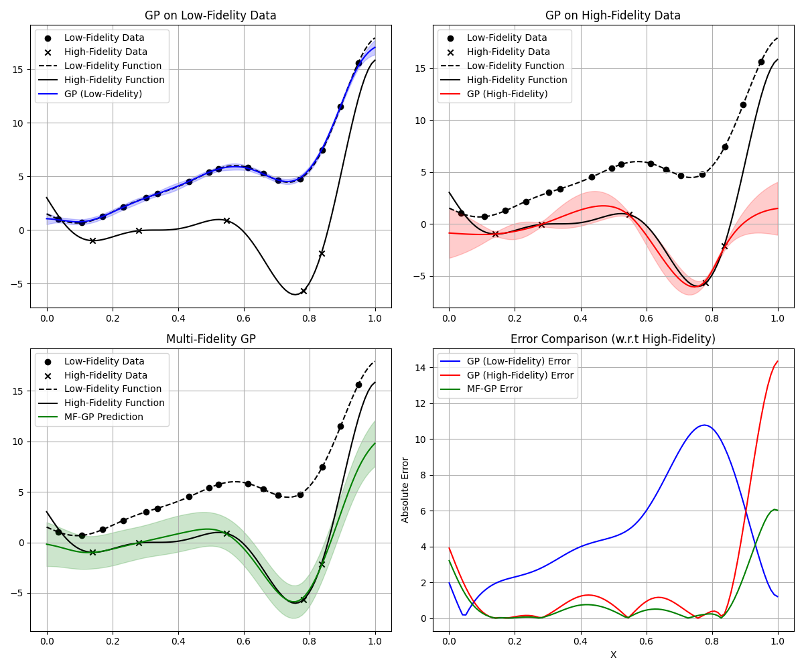

# Bayesian Optimization with Jax (BAOX)

- **baox** is a Python package for Gaussian process (GP) and single- or multi-objective Bayesian optimization. 
- It is built with Jax, a numerical computing library that allows for automatic differentiation and GPU acceleration.
- The package is designed to be modular and flexible, allowing users to easily define their own acquisition functions, kernels, and optimization algorithms.


## Examples

### Gaussian process regression

Give a set of input-output pairs `(X, y)`, we can fit a Gaussian process model to the data and make predictions at new input  `X_test`.

```python
from baox.surrogate import MaternKernel, SingleOuputGP

num_train = 32
data = generate_dataset(currin, [[0, 1], [0, 1]], random=True, num_samples=num_train)
# construct a GP model with Matern kernel
kernel = MaternKernel(lengthscale=jnp.array([1.0, 1.0]), variance=1.0)
gp = SingleOuputGP(data.x_train, data.y_train, kernel)
gp.fit()
```

An example figure of GP regression is shown below.

<p align="center">
  
</p>

### Auto-regressive multi-fidelity Gaussian process

Give data with different fidelity, we can fit an auto-regressive multi-fidelity Gaussian process model to the data and make predictions at new input `X_test`.

An example of fitting tow-fidelity data is shown below.

<p align="center">
  
</p>

### Single-objective Bayesian optimization using q-joint expected improvement

To optimize a single-objective function `f`, we can use the q-joint expected improvement acquisition function.

```python
from baox.bo import BayesianOptimization
from baox.acquisition import qExpectedImprovementFantasy, qExpectedImprovementJoint
import jax.numpy as jnp
from baox.test_functions import currin

bounds = [[0, 1], [0, 1]]
key = jax.random.key(42)

# qEI with batch size 3
bo_batch = BayesianOptimization(currin, bounds, n_iter=20, batch_size=3, acquisition=qExpectedImprovementJoint)
X_eval, y_eval = bo_batch.run(key)
X_opt_batch, y_opt_batch = X_eval[jnp.argmax(y_eval)], jnp.max(y_eval)
print("Optimal solution:", X_opt_batch, y_opt_batch)
```

<p align="center">
  
</p>


## Installation

To install the package, you can use pip:

```bash
git clone https://github.com/fengyiqi/baox.git
cd baox
pip install -e .
```

The package requires `jax` >= 0.5.0 and `jaxlib` >= 0.5.0.
